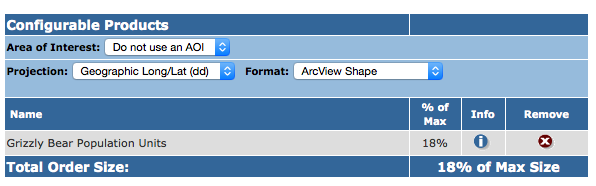
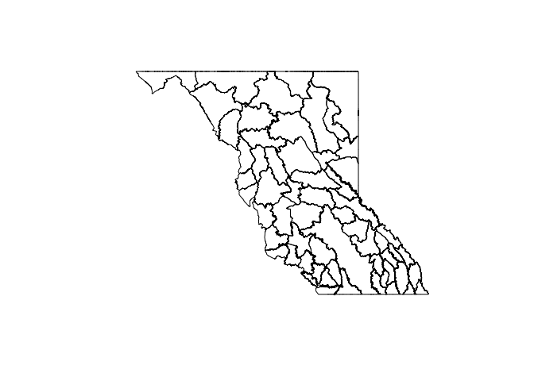
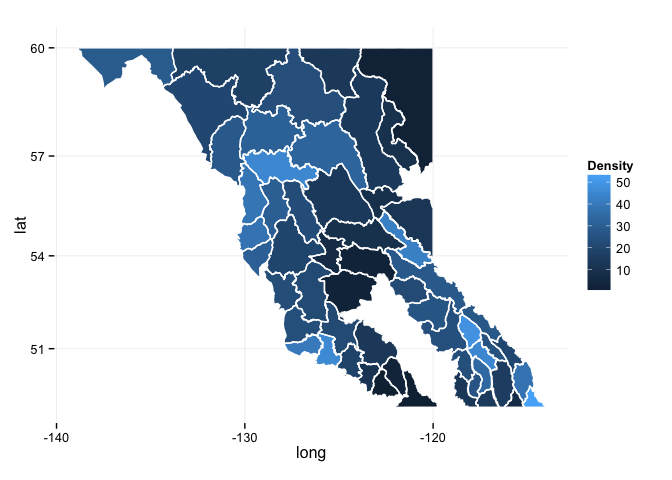

# Exploring Grizzly Data
  
June 5, 2015  


```r
library(tidyr)
library(dplyr)
library(knitr)
library(sp)
library(rgdal)
library(ggplot2)

options(knitr.table.format = "markdown")
```


### Grizzly Bear Population Units

First, you will need to get the data. Unfortunately, unlike the `.csv` files 
that we were able to read/download directly from DataBC. Visit the [metadata record](http://catalogue.data.gov.bc.ca/dataset/grizzly-bear-population-units/resource/7a7713f9-bcbd-46b8-968a-03d343d367fb) for the data at DataBC. Click on the 
**Go To Resource** button and submit the form with the following settings:



When you get the email with the link to the zip file, save it in your working directory as `data/DataBC_GBPU.zip`

Unzip the file, and import the shapefile. You will need the `sp` and `rgdal` packages


```r
unzip("data/DataBC_GBPU.zip", exdir = "data")

gbpu <- readOGR(dsn = "data/GBPU_BC/", layer = "GBPU_BC_polygon", 
                encoding = "ESRI Shapefile", stringsAsFactors = FALSE)
```

```
## OGR data source with driver: ESRI Shapefile 
## Source: "data/GBPU_BC/", layer: "GBPU_BC_polygon"
## with 278 features
## It has 9 fields
```

```
## Warning in readOGR(dsn = "data/GBPU_BC/", layer = "GBPU_BC_polygon",
## encoding = "ESRI Shapefile", : Z-dimension discarded
```


```r
## getting the data
mortality <- read.csv("http://www.env.gov.bc.ca/soe/archive/data/plants-and-animals/2012_Grizzly_Status/Grizzly_bear_mortality_history.csv", stringsAsFactors = FALSE)

population <- read.csv("http://www.env.gov.bc.ca/soe/archive/data/plants-and-animals/2012_Grizzly_Status/Grizzly_population_estimate_2012.csv", stringsAsFactors = FALSE)
```


Now that we have the data, let's look at the top of it. 


```r
kable(head(mortality))
```


|     X| HUNT_YEAR|  MU| GBPU_ID|GBPU_NAME              |KILL_CODE   |SEX |AGE_CLASS |SPATIAL |X.1 |X.2 |X.3 |X.4                                                                                                                                                                                                                         |
|-----:|---------:|---:|-------:|:----------------------|:-----------|:---|:---------|:-------|:---|:---|:---|:---------------------------------------------------------------------------------------------------------------------------------------------------------------------------------------------------------------------------|
| 12038|      1976| 316|      40|Stein-Nahatlatch       |Hunter Kill |M   |'5-9      |no      |NA  |NA  |NA  |Notes                                                                                                                                                                                                                       |
| 12137|      1976| 332|      36|South Chilcotin Ranges |Hunter Kill |M   |'0-2      |no      |NA  |NA  |NA  |Prior to 2004, road and rail kills were not distinguished and were documented with 'Pick Ups'.                                                                                                                              |
| 12077|      1976| 332|      36|South Chilcotin Ranges |Hunter Kill |M   |NA        |no      |NA  |NA  |NA  |A Limited Entry Hunt (LEH) was instituted province-wide for grizzly bears in 1996.                                                                                                                                          |
| 12090|      1976| 402|      35|Flathead               |Hunter Kill |F   |'10-14    |no      |NA  |NA  |NA  |There was a province-wide moratorium on hunting grizzly bears in the spring of 2001.                                                                                                                                        |
| 12100|      1976| 402|      35|Flathead               |Hunter Kill |M   |'10-14    |no      |NA  |NA  |NA  |A limited number of records with a value of 'no' in the SPATIAL column have not been spatially verified and thus may be assigned to the incorrect Management Unit (MU); most of these assignment errors are from 1976-1980. |
| 12099|      1976| 402|      35|Flathead               |Hunter Kill |M   |'15+      |no      |NA  |NA  |NA  |                                                                                                                                                                                                                            |

We're going to use packages to organize and clean our data.


```r
## let's get rid of unused columns
mortality <- mortality %>% 
  select(-contains("X."))


clean_mort <- mortality %>%
  separate(AGE_CLASS, into = c("minimum_age", "maximum_age"), sep = "-", extra = "merge") %>% 
  mutate(minimum_age = extract_numeric(minimum_age),
         maximum_age = extract_numeric(maximum_age))

kable(head(clean_mort))
```


|     X| HUNT_YEAR|  MU| GBPU_ID|GBPU_NAME              |KILL_CODE   |SEX | minimum_age| maximum_age|SPATIAL |
|-----:|---------:|---:|-------:|:----------------------|:-----------|:---|-----------:|-----------:|:-------|
| 12038|      1976| 316|      40|Stein-Nahatlatch       |Hunter Kill |M   |           5|           9|no      |
| 12137|      1976| 332|      36|South Chilcotin Ranges |Hunter Kill |M   |           0|           2|no      |
| 12077|      1976| 332|      36|South Chilcotin Ranges |Hunter Kill |M   |          NA|          NA|no      |
| 12090|      1976| 402|      35|Flathead               |Hunter Kill |F   |          10|          14|no      |
| 12100|      1976| 402|      35|Flathead               |Hunter Kill |M   |          10|          14|no      |
| 12099|      1976| 402|      35|Flathead               |Hunter Kill |M   |          15|          NA|no      |

Let's tidy up the population data. The first, eighth, and ninth columns (`X.`) doesn't contain any useful information, so we can get rid if it:


```r
## We can do it directly on each column like so:
# population$X <- NULL
# population$X.1 <- NULL
# population$X.2 <- NULL

## Or we can use a loop to do it.  This would be effective if there 
## were a lot of columns we wanted to get rid of

for (n in names(population)) {
  if (grepl("X", n)) {
    population[n] <- NULL
  }
}
```

Now we see that there is some metadata in the first five rows of the `Notes.` column. We should remove it and store it in a variable:


```r
population_meta <- paste(population$Notes.[1:5], collapse = "; ")
population$Notes. <- NULL
```

We can store the metadata as a comment attribute of the population data frame:


```r
comment(population) <- population_meta
```

We can view the comment using similar syntax:


```r
comment(population)
```

```
## [1] "Please see the full report for more information and details on how these estimates were made: http://wwwd.env.gov.bc.ca/fw/wildlife/docs/Grizzly_Bear_Pop_Est_Report_Final_2012.pdf; GBPU = Grizzly bear population unit; MU = Management Unit; Total_Area is the amount of usable grizzly bear habitat (i.e., removed large rivers, lakes, glaciers etc.); Density is the estimated number of Grizzly bears/1000 sq km."
```

The population estimates are split up by Population Unit (`GBPU`) and Management Unit (`MU`). Let's summarise by Population Unit. `dplyr` has some great functions for this sort of exploratory analysis.


```r
## First we set the grouping variable to be GBPU
population_gbpu <- group_by(population, GBPU)

## Then we can summarize based on those groups. We will need to recalculate 
## the density.
population_gbpu <- summarise(population_gbpu, 
                             Estimate = sum(Estimate, na.rm = TRUE), 
                             Total_Area = sum(Total_Area, na.rm = TRUE), 
                             Density = Estimate / Total_Area * 1000)
head(population_gbpu)
```

```
## Source: local data frame [6 x 4]
## 
##                        GBPU Estimate Total_Area   Density
## 1                      Alta      132      13239  9.970542
## 2                    Babine      313      13805 22.672945
## 3 Blackwater-West Chilcotin       53      20416  2.596003
## 4             Bulkley-Lakes      439      22554 19.464397
## 5                   Cassiar      612      35803 17.093540
## 6          Central Monashee      147       6155 23.883022
```


## All columns should have the same data type


### Let's explore the gbpu spatial object. 

It is of class `SpatialPolygonsDataFrame`, which is a special class of **R** object for representing spatial data, implemented in the `sp` package.


```r
class(gbpu)
```

```
## [1] "SpatialPolygonsDataFrame"
## attr(,"package")
## [1] "sp"
```

```r
summary(gbpu)
```

```
## Object of class SpatialPolygonsDataFrame
## Coordinates:
##          min        max
## x -138.87460 -112.37761
## y   46.95695   60.00142
## Is projected: FALSE 
## proj4string :
## [+proj=longlat +datum=NAD83 +no_defs +ellps=GRS80 +towgs84=0,0,0]
## Data attributes:
##     GBPU_TAG       GBPU_YRMOD   GBPU_VERS          GBPU_NAME        
##  Min.   : 0.00   Min.   : NA   Length:278         Length:278        
##  1st Qu.:23.00   1st Qu.: NA   Class :character   Class :character  
##  Median :42.50   Median : NA   Mode  :character   Mode  :character  
##  Mean   :42.68   Mean   :NaN                                        
##  3rd Qu.:64.00   3rd Qu.: NA                                        
##  Max.   :85.00   Max.   : NA                                        
##                  NA's   :278                                        
##     OBJECTID         GBPU_ID        GBPU_DISP          GBPUSTATUS       
##  Min.   :  1.00   Min.   : 841.0   Length:278         Length:278        
##  1st Qu.: 70.25   1st Qu.: 910.2   Class :character   Class :character  
##  Median :139.50   Median : 979.5   Mode  :character   Mode  :character  
##  Mean   :139.50   Mean   : 979.5                                        
##  3rd Qu.:208.75   3rd Qu.:1048.8                                        
##  Max.   :278.00   Max.   :1118.0                                        
##                                                                         
##   GPBU_W_BC        
##  Length:278        
##  Class :character  
##  Mode  :character  
##                    
##                    
##                    
## 
```

From the [metadata page](http://catalogue.data.gov.bc.ca/dataset/grizzly-bear-population-units/resource/7a7713f9-bcbd-46b8-968a-03d343d367fb), we know that there are several versions of the population units in this file. From the summary above it looks like the version is stored in the `GBPU_VERS`. Let's only use the latest version (2012). Note that we can use subsetting using `[` just like we do on normal data frames.

We can then plot the polygons to have a quick look.


```r
gbpu <- gbpu[gbpu$GBPU_VERS == 2012, ]
plot(gbpu)
```

 

Now that we have a map of GBPUs, and a data frame with a single population estimate per GBPU, we can merge the population estimates into the SpatialPolygonsDataFrame.


```r
## First we should make sure that the GBPU names in the two objects are the same
setdiff(na.omit(gbpu$GBPU_NAME), population_gbpu$GBPU)
```

```
## [1] "North Purcells"         "Central-South Purcells"
```

```r
setdiff(population_gbpu$GBPU, na.omit(gbpu$GBPU_NAME))
```

```
## [1] "Central Purcells" "North Purcell"
```

```r
population_gbpu$GBPU[population_gbpu$GBPU == "Central Purcells"] <- "Central-South Purcells"
population_gbpu$GBPU[population_gbpu$GBPU == "North Purcell"] <- "North Purcells"

## Check to make sure they are equal now
all.equal(sort(population_gbpu$GBPU), sort(na.omit(gbpu$GBPU_NAME)))
```

```
## [1] TRUE
```

Now lets plot the map using ggplot2, and fill the polygons based on population density. First we need to use the function `fortify` from `ggplot2`, to turn the SpatialPolygonsDataFrame into a data frame, then merge the attributes from `population_gbpu`:


```r
gbpu_df <- fortify(gbpu, region = "GBPU_NAME")
gbpu_df <- merge(gbpu_df, population_gbpu, by.x = "id", by.y = "GBPU")

ggplot(gbpu_df, aes(x = long, y = lat, group = group)) + 
  geom_polygon(aes(fill = Density)) + 
  geom_path(colour = "white") + 
  coord_map() + 
  theme_minimal()
```

 

